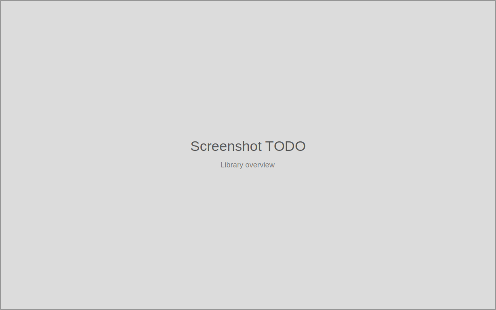
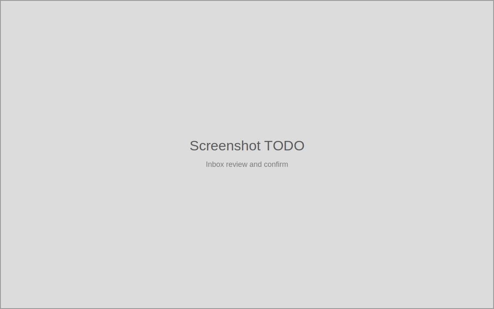

# PlateVault

[](https://www.gnu.org/licenses/agpl-3.0)

A local-first desktop app for organizing large astrophotography libraries:
map targets, sessions, and projects across a messy existing folder tree,
prepare PixInsight/WBPP-friendly inputs, and plan cleanup and archiving
safely. PlateVault never touches your files without a plan you review first,
and it never calibrates, stacks, or otherwise processes your images —
PixInsight/WBPP stays responsible for that.

<!-- Docs site: link goes here once it ships separately. -->

## Why

Astrophotography libraries grow large and messy: raw subs, calibration
frames, WBPP outputs, and years of capture-software exports scattered across
drives. PlateVault sits alongside your existing folders — it does not force a
migration — and gives you a reviewable, auditable record of what you have,
how it maps to targets and projects, and what's safe to clean up.

## Key features

- **Inbox review and confirm** — classify newly-arrived frames (or catalogue
  an already-organized folder in place) with a reviewable move/no-move plan
  before anything touches disk.
- **Sessions and calibration** — acquisition sessions and calibration masters
  are derived, always-current inventory, with masters matched to sessions by
  confidence level.
- **Target and project mapping** — link targets to projects, track project
  lifecycle from creation through tool launch to output tracking.
- **PixInsight/WBPP preparation** — generate tool-friendly source views and
  manifests without copying or duplicating your source files.
- **Safe cleanup and archive planning** — every move, copy, archive, or
  delete is a reviewable plan with an audit record; destructive operations
  prefer archive/trash over permanent deletion.
- **Full audit trail** — reconstruct what happened to your library at any
  point, including refused or failed actions and why.
- **Keyboard-first, localized, themeable** — drive the whole app without a
  pointer; appearance and language are configurable per install.

See `docs/journeys/` for the full set of supported user workflows.

## Screenshots

| Library overview | Inbox review and confirm | Cleanup plan |
|---|---|---|
|  |  |  |

(Placeholders — real screenshots are pending.)

## Download

Builds are published on [GitHub Releases](https://github.com/nightwatch-astro/alm/releases/latest).

| Platform | Package |
|---|---|
| Windows x64 | NSIS installer or MSI |
| Linux | AppImage, `.deb`, or `.rpm` |
| macOS (Apple Silicon only) | `.dmg` |

Bundles are signed for the built-in auto-updater (minisign), but **not**
signed with an OS-level code-signing certificate yet, so:

- **Windows**: SmartScreen will show an "unrecognized publisher" warning
  ("Windows protected your PC") — choose "More info" → "Run anyway".
- **macOS**: Gatekeeper will refuse to open the app as "from an unidentified
  developer" — right-click the app → "Open", or clear the quarantine
  attribute (`xattr -d com.apple.quarantine PlateVault.app`).

## Build from source

Requires [pnpm](https://pnpm.io) and a [Rust](https://www.rust-lang.org)
toolchain (Tauri v2 prerequisites for your OS).

```bash
pnpm install
pnpm --dir apps/desktop tauri dev
```

## License

PlateVault is licensed under the [GNU AGPL v3.0](LICENSE). If you modify this
software and make it available over a network, you must make your modified
source code available under the same license.

Contributions require signing a CLA (enforced by the CLA Assistant GitHub
Action on pull requests). See [CONTRIBUTING.md](CONTRIBUTING.md) for how to
contribute.
