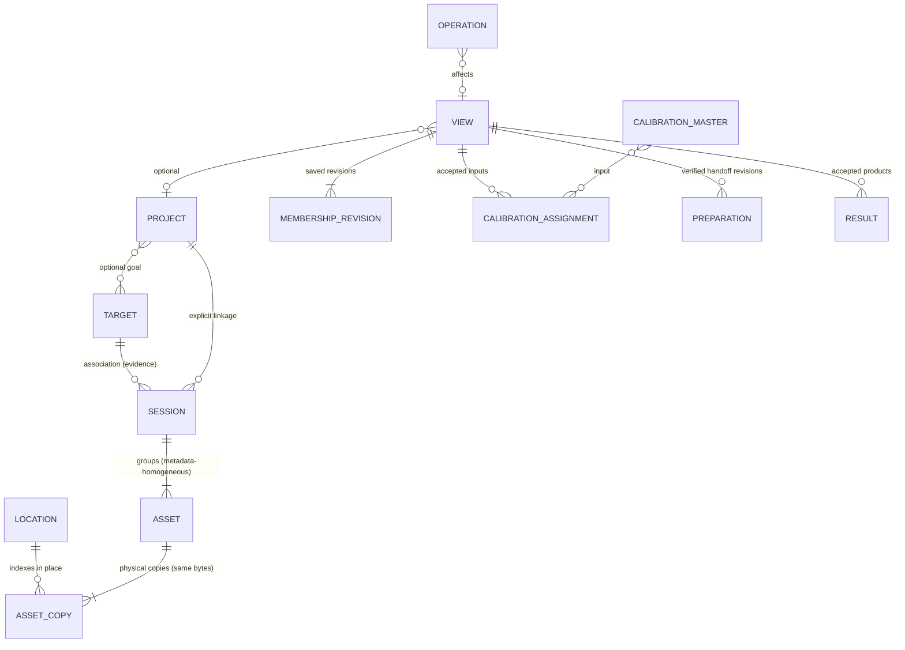
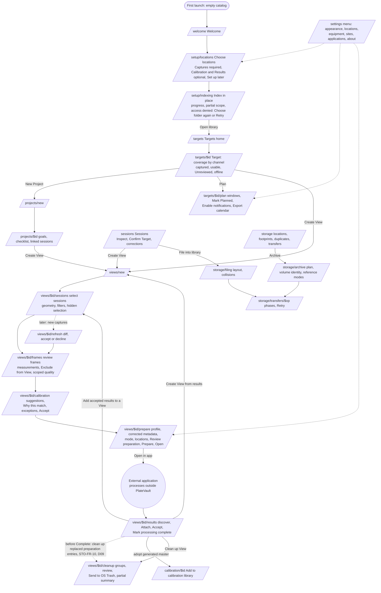

# PlateVault prototype: high-level design

Status: foundation baseline, 2026-10-04. Owner: foundation (integration owner).
Scope: the web prototype in `apps/prototype`. It is not final frontend acceptance
and makes no backend claim. Every number, path and name below is fixture data.

Sources, in precedence order: specs 063-072 (`specs/063-clean-rebuild-contract`
is the contract and decision register D01-D18), journeys J18-J30 (J10 and J15 for
Settings intent), the product flow `docs/reviews/2026-10-03-product-flow-and-journeys.md`
(interaction steps A1-L), then the legacy `DESIGN.md` and screenshots as idea
input only. Where a journey and a spec disagree, the spec wins (§14).

## 1. Product model

PlateVault is a local-first desktop library for astrophotography captures
(FITS/XISF). It indexes folders in place, groups frames into sessions, tracks
Target coverage and optional Project goals, and prepares exact, reviewed inputs
for external processing applications (PixInsight/WBPP, Siril, SETI Astro Suite
Pro, or a generic Open in…). It never calibrates, registers, integrates or
stretches images, and it never moves or deletes files without a reviewed,
approved operation.

Five trust rules shape every screen (063 FR-001 to FR-016):

1. **Custody.** Indexing records metadata only. Files change only through a
   reviewed operation (preparation, cleanup to OS Trash, verified archive,
   reviewed filing). Corrections change the catalog, never source headers.
2. **Honest uncertainty.** Offline, unreadable, unknown and unmeasured values
   are named as such. They are never shown as absent, zero, Missing or success.
3. **Explicit scope.** Library quality, View exclusion and Project rejection are
   separate decisions; each confirmation names its scope. Measurements never
   decide quality.
4. **Exact membership.** A View holds reviewed frame identities independent of
   browsing filters. Handoff accounts for every selected input; nothing
   disappears silently.
5. **Independent lifecycles.** Results acceptance, Complete, cleanup and
   archive are separate actions. Complete needs neither a Result nor cleanup.

### Domain objects (spec 063 Key Entities)

The prototype models two worlds (`src/domain/types.ts`):

- **Disk**: the simulated filesystem outside PlateVault: volumes (mounted,
  identity uuid, OS Trash support, link support), files with header evidence
  and content hashes, explicit (possibly empty) folders, denied and read-only
  paths, OS Trash. Files are keyed by volume and path (`fileKey`), so the
  impostor Archive never overwrites the real Archive's records; look a path up
  with `fileAt(disk, path)` and list folders with `listFolders`.
- **Catalog**: what PlateVault has indexed and decided.

Indexing (`src/domain/indexing.ts`) reads the disk into the catalog. Prototype
controls change the disk; PlateVault observes the change on its next read.

Identity rules (LIB-AC-10, LIB-AC-15, D15, D16):

- An **Asset** is one logical frame identified by its bytes. It has one or
  more `copies` (location, volume, path, sha256, presence). Indexing a file
  first matches a copy at the same path, then a byte-identical asset of the
  same image type (a copy or a move), and only then creates an asset. Totals
  count each asset once; availability is the best copy's.
- A **Session** is grouped by metadata only, never by location; its locations
  are derived (`sessionLocationIds`), as is its capture site (`captureSite`
  matches header coordinates against the saved sites when read).
- A regrouping revision sets `supersededBy` on the replaced session; superseded
  sessions stay inspectable and never count in totals or progress.

## 2. Information architecture and navigation

Targets is the default home (LIB-AC-09, LIB-FR-10). The sidebar has two groups
plus a utility footer:

| Group | Item | Route | Go-to key | Why it is primary |
|---|---|---|---|---|
| Library | Targets | `/targets` | `g t` | Default home; coverage, Projects, Results and planning per Target |
| Library | Sessions | `/sessions` | `g s` | Session table, evidence, corrections, Create View, File into library |
| Library | Calibration | `/calibration` | `g c` | Masters, raw sets, compatibility, adoption |
| Work | Projects | `/projects` | `g p` | Optional goals and checklists |
| Work | Views | `/views` | `g v` | Every saved View, including standalone ones |
| Work | Plans | `/plans` | `g l` | Planned Targets, reminder status, calendar exports |
| Work | Storage | `/storage` | `g o` | Locations, availability, View footprints, duplicates, transfers |
| Footer | Getting started (T1 slot) | n/a | n/a | J18 checklist; contributed by T1 |
| Footer | Activity | `/activity` | `g a` | Running work, refusals, failed writes, outcomes |
| Footer | Settings | `/settings` | `g ,` | Configuration menu |

Two deliberate additions to the spec's main navigation (063 product flow,
"Application surfaces"): **Views** and **Plans**. Standalone Views have no
Project and no single Target (VSEL-AC-07); without a Views list they could not
be reopened (J25 "Reopen the View", J27 "start in either View"). Reminders span
Targets and name one default site (PLAN-FR-03, PLAN-FR-06); their status and
exported snapshots need a home outside a single Target. Both are secondary to
the spec surfaces and add no new behaviour.

The View review surface and Results are not top-level items: they live inside
a View (§4). Night is a display grouping inside Sessions, never a navigation
level (LIB-FR-04).

### Command palette (justified)

Libraries hold tens of thousands of frames, users work long keyboard sessions,
and the IA has ~35 routes with record-level destinations (Targets, Sessions,
Projects, Views). The palette (`Mod+K`) lists every surface, every named record
and global actions (theme, sidebar, simulation controls, shortcuts). Tracks add
commands through their shell contribution (§12). It is built on Base UI Dialog
and Autocomplete; there is no cmdk, so only one primitive system ships.

### Header and status area

Left: sidebar toggle and the palette trigger. Right, the status area:

- running operation with percent (links to Activity), and `+N` more;
- interrupted operations after a restart (links to Activity, offers Retry there);
- offline locations ("Cold-1 captures offline", links to Storage);
- **Prototype** button: opens the simulation controls (§13);
- theme menu: Dark (default), Light, Match system.

First-run gating: until `settings.onboarding.completedAt` is set, every route
except `/welcome`, `/setup/*` and `/settings/*` redirects to `/welcome` when no
location exists, or to `/setup/locations` when setup was left unfinished
(root `beforeLoad`). T1 sets `completedAt` on Open library and on any "set up
later" exit. Onboarding uses a focused shell with no sidebar.

## 3. End-to-end user process

Journey coverage (route → journey steps):

| Journey | Path through the prototype | Tracks |
|---|---|---|
| J18 orientation | `/welcome` → setup → Getting started flyout (sidebar slot) → tour overlay | T1 |
| J19 index in place | `/setup/locations` → `/setup/indexing` → `/sessions` → `/sessions/$id`; Settings › Locations for Retry | T1, T2 |
| J20 Target and Project | `/targets/$id` → `/projects/new?targetId=` → `/projects/$id` → `/views/new?from=project` | T2 → T3 |
| J21 select sessions | `/views/$id/sessions` | T3 |
| J22 frames and quality | `/views/$id/frames` | T3 |
| J23 calibration and profile | `/views/$id/calibration` → `/views/$id/prepare`; Settings › Applications | T4 |
| J24 prepare and open | `/views/$id/prepare` | T4 |
| J25 refresh | `/views/$id/refresh` (Simulation: copy 2 Oct captures; Settings › Locations rescan) | T3, T1 |
| J26 results and masters | `/views/$id/results` → `/views/new?from=results` → `/calibration/$id` | T5 → T3, T4 |
| J27 complete and cleanup | `/views/$id/results` (Mark processing complete) → `/views/$id/cleanup` | T5 |
| J28 verified archive | `/storage` → `/storage/archive` → `/storage/transfers/$op` | T5 |
| J29 plans and reminders | `/targets/$id/plan`, `/settings/sites`, `/plans` | T5, T1 |
| J30 reviewed filing | `/sessions` → `/storage/filing?sessionIds=` → `/storage/transfers/$op` | T2 → T5 |
| J10 settings | `/settings/*` | T1 |
| J15 equipment and sites | `/settings/equipment`, `/settings/sites` | T1 |

## 4. Screen inventory and fixed routes

Paths are fixed in `src/routes.tsx`. Tracks replace the page bodies exported
from `src/features/<track>/routes.tsx` and keep the export keys. Hash history:
URLs read `#/targets/…`.

### T1: onboarding, setup and Settings (J18, J10, J15, J19 registration; spec 064 locations)

| Route | Screen | Purpose and key states |
|---|---|---|
| `/welcome` | Welcome | What PlateVault does and does not do; Set up locations. Prototype-only: load the demo library, labelled as such |
| `/setup/locations` | Choose locations | A1-A2: Add capture location (simulated folder picker), display name, role, access, online; Calibration and Results optional with Set up later; cannot continue without one Captures location; omitted roles read "Not set" |
| `/setup/indexing` | Index your captures | A3-A4: Start indexing (`startIndexing`), progress counts, provisional totals, access denied with Choose folder again or Retry, Open library |
| `/settings` | Settings layout | Section navigation + child outlet; index redirects to Appearance |
| `/settings/appearance` | Appearance | Theme (Dark default, Light, Match system), density (compact, comfortable, spacious) via `src/app/preferences.ts` |
| `/settings/locations` | Locations | Registered locations by role; display names; access and online state; Index now, Rescan, Choose folder again, Retry; remap with same-asset proof (D11) |
| `/settings/equipment` | Equipment | Cameras, telescopes, optical trains, filters; Manual vs Detected; in-use deletion refused |
| `/settings/sites` | Observing sites | Sites (lat, lon, elevation, IANA zone, twilight, minimum altitude); explicit default site (no automatic default, §14) |
| `/settings/targets` | Target lookup | Online Target resolution on/off and provider (`settings.targetLookup`); local search always works; resolver failure stays visible (LIB-AC-12, D18) |
| `/settings/about` | About this prototype | "Prototype" label, version, seed and Reset, `SimulationControls`, replay orientation |

### T2: library (specs 064, 065; J19, J20)

| Route | Screen | Purpose and key states |
|---|---|---|
| `/targets` | Targets (home) | Search (offline), coverage summary per Target, Needs review counts, planned flag; first-run empty state |
| `/targets/$targetId` | Target | B1: per-channel captured, library-usable, Unreviewed; offline contributions with last observation; availability separate; Projects, Views, accepted Results; New Project, Create View, Plan |
| `/sessions` | Sessions | Table; group by night (display only); filters; select; Create View; File into library; Inspect; provisional totals while indexing |
| `/sessions/$sessionId` | Inspect session | Observed vs confirmed evidence; Confirm Target, Confirm equipment; catalog corrections and grouping revision (D15); frames with quality; failed write and stale refusal |
| `/projects` | Projects | Goals, checklist progress, linked sessions, Views, accepted products (PRJ-FR-07) |
| `/projects/new` | New Project | B2: name, notes, prefilled Target (`?targetId=`), panels, equipment, checklist; no side effects |
| `/projects/$projectId` | Project | Captured, library-usable and Project-accepted progress; explicit session linkage; sites per session; Create View |
| `/activity` | Activity | Every operation and outcome; failed and refused writes; links to the owning surface |

### T3: View workspace and frame review (specs 066, 067; J21, J22, J25)

| Route | Screen | Purpose and key states |
|---|---|---|
| `/views` | Views | All Views with status (Draft, Saved, Prepared, Complete), Project or standalone, membership totals |
| `/views/new` | New View | Creates a draft from `?from=project|target|sessions|results` with ids; name; optional Project |
| `/views/$viewId` | Workspace host (layout) | View name, Project, profile, status, membership summary, Save View (D08), Reopen, area tabs: Sessions · Frames · Calibration · Prepare · Results · Cleanup; index redirects to Sessions |
| `/views/$viewId/sessions` | Sessions in this View | C1-C6: suggestions with evidence, FOV/position unknown, filters and chips, Selected outside current filters, Show selected, sky coverage, unavailable sources |
| `/views/$viewId/frames` | Review frames | D1-D6: cached and pending measurements, row/plot/preview linkage, stretch, Stars, Exclude from View, Mark included frames usable, Mark unusable in library, Reject for Project, Import measurements |
| `/views/$viewId/refresh` | Refresh selection | G: added/removed with reasons, Unavailable not removed, accept/decline per change, Keep unchanged |

### T4: calibration and handoff (specs 068, 069; J23, J24)

| Route | Screen | Purpose and key states |
|---|---|---|
| `/calibration` | Calibration | Masters and raw sets grouped by camera, settings, channel, geometry; compatibility; candidates with Add to calibration library |
| `/calibration/$calibrationId` | Master or raw set | Evidence, origin, provenance, usage; adoption with verified copy (D05) |
| `/views/$viewId/calibration` | Calibration for this View | E1-E2: suggestions vs accepted, Why this match, scoped exception with reason, defer, exclude; Accept assignments |
| `/views/$viewId/prepare` | Prepare and open | E3-E4, F1-F6: profile, capability evidence, corrected metadata, input mode with refusals, View and output locations, Review preparation, Prepare (Prepared, Partial, Failed, Canceled, Paused), Open in…, Reveal View |
| `/settings/applications` | Applications | Profiles, executable state, capability evidence, generic Open in… |

### T5: results, storage custody and plans (specs 070, 071, 072; J26-J30)

| Route | Screen | Purpose and key states |
|---|---|---|
| `/views/$viewId/results` | Results | H1-H3a: candidates vs intermediates, Pending, Attach Result, lineage, Accept Result, Create View from results; I1 Mark processing complete; drift |
| `/views/$viewId/cleanup` | Clean up View | I2-I5: groups, Keep, Inspect files, Review cleanup, Trash support per location, Send selected files to Trash, partial summary |
| `/storage` | Storage | Locations and availability, View footprints, duplicate candidates, transfers (STO-FR-11); per View: Clean up View (→ `/views/$id/cleanup`); offline or moved copies: Locate or remap (→ `/settings/locations?locationId=`) |
| `/storage/archive` | Archive | J: plan from `?sessionIds=` or `?viewId=`, destination identity, free space, reference modes, Review transfer |
| `/storage/filing` | File into library | L: layout preview, collisions, Review filing (`?sessionIds=`) |
| `/storage/transfers/$operationId` | Transfer | Phases per item, interruption, Retry, reference outcomes |
| `/plans` | Plans | Planned Targets, default site, reminder status and permission, exports |
| `/targets/$targetId/plan` | Plan | B3, K: planning site, criteria, windows with site and zone, checklist gaps, Mark Planned, Enable notifications, Export calendar |

### Foundation

| Route | Screen | Purpose |
|---|---|---|
| `/` | redirect | `/targets`, or `/welcome` on first run |
| `/design-system` | Design system reference | Tokens and every shared component in its states (palette only) |
| any unknown | Not found | One next action: Go to Targets |

### Documented search parameters

Search params are loose string maps, so a track may add keys. These are fixed:

| Route | Key | Meaning |
|---|---|---|
| `/projects/new` | `targetId` | Prefilled Target |
| `/views/new` | `from` | `project`, `target`, `sessions` or `results` |
| `/views/new` | `projectId`, `targetId` | Context ids |
| `/views/new` | `sessionIds`, `resultIds` | Comma-separated ids |
| `/storage/archive` | `sessionIds` or `viewId` | Archive scope |
| `/storage/filing` | `sessionIds` | Sessions to file |
| `/settings/sites`, `/settings/equipment`, `/settings/locations`, `/settings/applications` | `return` | Route to return to after the task, without `#` (for example `/targets/<id>/plan`) |
| `/settings/locations` | `locationId` | Location to open (C6, remap) |
| `/calibration/$masterId` | `viewId` | View whose assignment opened the master |
| `/views/new` | `viewId` | Existing View to add accepted Results to (H3a alternative); with `resultIds` |
| `/views/$viewId/frames` | `assetId` | Frame to select |

## 5. Cross-track handoffs (seams)

A track never imports another track's folder. Seams use only routes and search
params, the shared catalog, and foundation core actions.

| # | From → to | Trigger | Contract |
|---|---|---|---|
| 1 | T1 setup → library | Start indexing / Open library | T1 calls `startIndexing(ids)`; renders `OperationPanel`; Open library → `/targets`; sets `settings.onboarding.completedAt` |
| 2 | T1 Settings › Locations ↔ T2 | Rescan, Retry, Choose folder again | `startIndexing`; T2 surfaces read `location.scanScope`, `unreadablePaths`, `access` and session `scope` |
| 3 | T2 evidence → T1 equipment | Confirm equipment with no record | Link `/settings/equipment?return=/sessions/<id>`; records in `catalog.opticalTrains`; Confirm equipment promotes a `detected` train to `manual` |
| 4 | T2 Target → T2 Project | New Project | `/projects/new?targetId=` |
| 5 | T2 Target, Project, Sessions → T3 | Create View | `/views/new?from=target|project|sessions&…`; T3 creates the draft |
| 6 | T2 Target → T5 Plan | Plan | `/targets/$id/plan` |
| 7 | T5 Plan → T1 sites | Enable notifications with no default site | `/settings/sites?return=/targets/<id>/plan`; `settings.defaultSiteId` |
| 8 | T3 workspace → T4 areas | Calibration and Prepare tabs | Same layout and one shared selection: the Calibration area reads `view.draft`, else the latest revision (C1, VSEL-AC-07). Only Review preparation and Prepare require a saved revision with no unsaved draft. T4 writes `view.calibration` and `catalog.preparations`; Prepared is derived (`viewStatus`) |
| 9 | T4 Prepared → T5 Results | Open in…, then Results tab | T5 discovers files under `preparation.outputPath` |
| 10 | T5 Results → T3 | Create View from results | `/views/new?from=results&resultIds=`; T3 records `productInputs` and shows them apart from raw sessions |
| 11 | T5 Results → T4 | Generated master in output | T4 detects candidates in recorded output locations; T5 links the file to `/calibration/<masterId>` |
| 12 | T3 frames → T2 coverage, T2 Project | Mark usable, Reject for Project | T3 writes `asset.quality` (library scope) or `project.rejections`; T2 recomputes through `src/domain/derive.ts` |
| 13 | T5 Complete ↔ T3 | Mark processing complete, Reopen | T5 sets `completedAt` (blocked while `unsettledOperationsForView` returns any operation; archive and filing list affected Views in `scope.viewIds`); T3's Reopen clears it and refuses membership edits while Complete |
| 14 | T2 Sessions → T5 filing | File into library | `/storage/filing?sessionIds=` |
| 15 | T5 archive, filing → T3, T4 | Verified transfer | T5 adds the destination to `asset.copies` (same bytes, same asset) and marks the source copy absent after a verified move; it rebuilds preparation entries; membership never changes |
| 16 | Any → T2 Activity | Every operation | `settleOperation` records the outcome with an `href` to the owning surface, a route without `#` (indexing → `/settings/locations`) |

## 6. Layout patterns

| Pattern | Where | Rules |
|---|---|---|
| Table page | Targets, Sessions, Projects, Views, Activity, Storage | `PageHeader` with the primary action last; filters and `FilterChips` above a `DataTable`; empty and loading states inside the table frame |
| List + detail | Calibration, Settings sections, Session inspect when opened from a list | `ListDetail`: 18rem list (22rem at xl), detail fills the rest; the list keeps scroll and selection |
| Focused flow | Onboarding (`SetupShell`) | One task per screen, `StepIndicator`, Back is never destructive, progress persists |
| Workspace | View (`/views/$viewId/*`) | One persistent header with the membership summary and Save View; area tabs, not a forced wizard (VSEL-FR-02); every area shares one selection. The layout owns the page `h1`; each area renders `PageHeader level={2}` (Settings sections follow the same rule) |
| Review → apply | Prepare, Cleanup, Archive, Filing, Refresh, Import mapping | Plan screen (inputs, footprint, conflicts) → explicit Review (exact list, what changes and what stays) → `ConfirmDialog` → `OperationPanel` with per-item outcomes → summary. No write before the confirm |
| Detail page | Target, Project, Plan, Transfer | `PageHeader` with eyebrow context, `Section`s, `KeyValueList` for evidence |

Widths: the prototype is reviewed at 1280 and 1024 CSS px. At 1024 the sidebar
stays expanded (224 px) unless collapsed; content gets 800 px. Tables scroll
horizontally inside their frame, never the page.

## 7. Tokens

Tailwind CSS v4 defaults plus shadcn CSS variables (`src/index.css`). Establishing
this scale was approved in the brief. Neutral base, one accent, light and dark
themes; dark is the default for night use.

### Colour roles

| Token | Dark | Light | Use |
|---|---|---|---|
| `--background` | `oklch(0.155 0 0)` | `oklch(0.99 0 0)` | Canvas |
| `--foreground` | `oklch(0.93 0 0)` | `oklch(0.18 0 0)` | Text; 0.93, not white, in dark |
| `--card` / `--popover` | `0.195` / `0.205` | white / white | Raised surfaces |
| `--muted-foreground` | `oklch(0.72 0 0)` | `oklch(0.47 0 0)` | Secondary text, ≥ 4.5:1 on canvas |
| `--primary` (accent) | `oklch(0.74 0.11 238)` | `oklch(0.5 0.13 242)` | Primary action, selection, links, focus ring, current-item bar. One accent per view |
| `--ring` | = primary | = primary | Focus: one 2 px outline, 2 px offset (inset −2 px inside popups and cells), unlayered rule in `index.css` |
| `--success` | `oklch(0.75 0.13 155)` | `oklch(0.43 0.12 155)` | Usable, verified, Prepared, Online. Light badge text (over its 12% tint) is ≥ 4.5:1 on every row surface, including the active row |
| `--warning` | `oklch(0.8 0.13 80)` | `oklch(0.5 0.12 65)` | Needs review, Offline, Partial, Changed content, Unresolved |
| `--destructive` | `oklch(0.71 0.17 22)` | `oklch(0.48 0.2 27)` | Failed, refused, blocked, destructive action |
| `--info` | = primary | = primary | Icon colour only for Running, Provisional, Associated, Suggested; the badge text stays neutral |
| `--accent` | `oklch(0.3 0 0)` | `oklch(0.91 0 0)` | shadcn hover and highlighted-option surface (not the brand accent) |
| `--border` / `--input` | white 11% / `oklch(0.53 0 0)` | `0.89` / `0.62` | Dividers (decorative) / control boundaries (≥ 3:1, WCAG 1.4.11) |

No gradients, glow, purple or blur. Status is never colour alone: every status
badge has an icon and a label (§8). Contrast is measured, not assumed (§15).

### Type scale (Tailwind defaults, system font stack)

| Role | Class | Size/line |
|---|---|---|
| Page title (h1) | `text-lg font-semibold text-balance` | 18/28 |
| Section (h2) | `text-base font-semibold` | 16/24 |
| Sub-section (h3) | `text-sm font-semibold` | 14/20 |
| Body, controls, table cells | `text-sm` | 14/20 |
| Meta, captions, table headers | `text-xs text-muted-foreground` | 12/16 |
| Paths, hashes, header keywords | `font-mono text-xs` | 12/16 |
| Numbers | `tabular-nums` | always for data |

No letter-spacing changes. Headings `text-balance`, paragraphs `text-pretty`.

### Spacing, radius, density, layers

- Spacing: Tailwind 4 px scale. Control gap `gap-2`, card padding `p-4`, page
  padding `px-6 py-5`, section gap `space-y-6`, page header `py-4`.
- Radius: `--radius: 0.375rem` (instrument-grade, tighter than shadcn): `rounded-sm`
  3.6 px, `rounded-md` 4.8 px, `rounded-lg` 6 px, `rounded-xl` 8.4 px.
- Density (dial 7): `--row-h` 28 / **32** / 40 px for compact / comfortable /
  spacious, set by `html[data-density]` (Settings › Appearance). Controls are
  32 px (`h-8`, base-nova), small controls 28 px, icon-xs 24 px minimum.
- Z-index (fixed scale, no arbitrary values): `z-1` pinned table cells (under
  the header row), `z-10` sticky table headers,
  `z-20` shell header, `z-30` non-modal flyouts anchored to the shell (J18
  checklist), `z-50` portalled layers (dialogs, sheets, menus, popovers,
  tooltips; DOM order decides).
- Motion (dial 2): only Base UI/shadcn open-close fades (≤ 150 ms, opacity and
  transform), the running spinner, and nothing else. `prefers-reduced-motion`
  disables all of it.

## 8. Component inventory

`src/components/ui/*`: shadcn base-nova on Base UI (`@base-ui/react` 1.8):
alert, alert-dialog, badge, breadcrumb, button, button-group, card, checkbox,
collapsible, combobox, dialog, dropdown-menu, empty, field, input, input-group,
kbd, label, popover, progress, radio-group, scroll-area, select, separator,
sheet, skeleton, spinner, switch, table, tabs, textarea, toggle, toggle-group,
tooltip. Removed from the generated set: `command` (cmdk pulls Radix) and
`sonner` (pulls next-themes); errors sit next to actions instead of toasts.
Overlays have no backdrop blur.

`src/components/app/*` (foundation-owned shared domain components):

| Component | File | Variants / props | Applicable states (N/A reason) |
|---|---|---|---|
| `StatusBadge` | status.tsx | `kind` × `value` from `STATUS` (availability, access, scanScope, role, quality, association, operation, item, view, preparation, assignment, match, lineage, acceptance, processing, content, custody, master, measurement, save, reminders, trash) | default; selected via row; others N/A: not interactive |
| `PageHeader`, `Section`, `PageBody` | page.tsx | eyebrow, meta, actions; section level 2/3; the title block takes the free width and wraps, so actions stay top-right beside long descriptions; `PageHeader` names the browser tab (`useDocumentTitle`: "Sessions · View workspace · PlateVault prototype") | default only: structural |
| `ListDetail` | page.tsx | list label | default; selected item is the list's concern |
| `StepIndicator` | page.tsx | current, completed | default, selected (current step); not interactive |
| `PlaceholderPage` | page.tsx | track owner | scaffold only; tracks replace it |
| `EmptyState` | feedback.tsx | icon, title (`titleAs` h1/h2/h3, default h3), description, one required action | empty |
| `Notice` | feedback.tsx | info, offline, warning, refusal (role=alert) | default; actions inherit button states |
| `ActionError` | feedback.tsx | message, Retry | error |
| `SaveState` | feedback.tsx | saved, unsaved, saving, failed (Retry), stale (Review current revision). Announced through `announce`: every change while mounted, and failed or stale when it appears with them; never "Unsaved changes", nor "Saved" on appearing | loading (saving), error (failed, stale) |
| `LiveAnnouncer`, `announce(message)` | feedback.tsx | the one persistent polite live region, mounted by `RootLayout` before any dialog opens (Base UI leaves `[aria-live]` outside a modal's inert area); for status shown by an element that mounts with its text | N/A: not visible |
| `UnknownValue` | feedback.tsx | Unknown, Not measured, Position unknown, FOV unknown, Not set; a `reason` makes it a button (tooltip trigger, dotted underline) named "label: reason" | default, focus-visible when it has a reason |
| `TableSkeleton`, `DetailSkeleton` | feedback.tsx | rows, columns; `role=status` with sr-only label text | loading |
| `KeyValueList` | data.tsx | mono, source (mono, wraps); `columns={2}`. Layout is a container query on the list's own width, so it follows text zoom: two columns from 46rem, label beside value from 22rem, label above value below | default |
| `EvidenceList` | data.tsx | agrees / conflicts / unknown | default |
| `Stat`, `PathText` | data.tsx | hint; paths wrap by default, `truncate` only in table cells whose detail pane shows the full path | default |
| `ChannelCoverage` | data.tsx | breakdown, goal | default, empty (0h 00m shown, never hidden) |
| `FilterChips` | data.tsx | chips, match label; stays mounted so the live count announces; removing a chip focuses the next chip, else the previous, else the page search (`data-page-search`), else the group | default, hover, focus-visible, active; empty shows nothing visible |
| `DataTable` | data-table.tsx | columns (sort, `truncate`, row header), controlled selection, active row (inset accent bar), `scroll` frame with pinned header, empty, loading (keeps the real header), `groups` (`key`, `label`, `compare`: group header rows, `th scope="rowgroup"`, in one table so columns line up across groups; sort applies within groups, select-all and ↑/↓ span groups). Use `groups` instead of one table per group. `stickyFirstColumn` (wide tables at 1024 px): the selection column and the first column stay in view while the table scrolls sideways; pinned cells sit under the header row and take the row's tint, scroll padding their width keeps a focused cell clear of them, group labels stay in view; the frame takes the card surface, and `rowClassName` backgrounds do not reach pinned cells | default, hover, focus-visible, active, disabled (row not selectable), loading, empty, selected (and selected + hover); error is the caller's `Notice` |
| `TableToolbar` | data-table.tsx | search (`data-page-search`, focused by `/`), filters, actions | default, focus-visible; empty N/A |
| `SelectionBar` | data-table.tsx | count, "Selected outside current filters: N", Show selected, Clear selection (`clearDisabledReason`: disabled, still focusable, the reason beside it and in its description), bulk actions | selected, disabled (Clear with a reason); renders nothing when empty |
| `ConfirmDialog` | confirm-dialog.tsx | changes, unchanged, tone, CommitResult error | default, focus-visible, error (stays open with Retry); loading N/A: commits are synchronous |
| `OperationPanel` | operation-panel.tsx | Pause, Resume, Retry, Cancel by kind; `headingLevel` (2/3/4, default 3: pass 2 directly under the page h1); a pressed control that is replaced hands focus to its replacement, else to the panel title; progressbar keeps a stable name, the count is its `aria-valuetext` | loading (running), error (failed/blocked items), empty (no items), success, partial, interrupted |
| `FolderPicker` | folder-picker.tsx | simulated OS folder chooser: volumes (offline shown with reason), breadcrumb, Up, child folders including empty ones, denied folders marked; returns a path, writes nothing | default, hover, focus-visible, active, disabled (offline volume, Up at a volume root), empty (no subfolders), error (access denied: listed with a Notice, still choosable), selected (current volume `aria-current`); loading N/A: the simulated disk is synchronous |

Route changes (`MainArea`, shell.tsx): when the activated control leaves with the old page, focus moves to the URL anchor, else the page h1, else `#main`; a surviving control (sidebar link, View tab) keeps focus; the new document title is announced in a polite live region. Search-param changes never move focus.

Base UI usage notes (verified in the running build):

- `Select` shows the raw value unless the root receives `items` (`{ value, label }[]`).
  Pass `items` whenever values are ids.
- `Select` ignores a click on an option made immediately after opening; drive it
  with real pointer timing or the keyboard in reviews.
- `Checkbox` and `Switch` render a visually hidden native input with
  `aria-hidden="true"` for forms; snapshots list it, assistive technology does not.
- `AlertDialog` puts initial focus on Cancel; the destructive action is never
  the default.
- `DialogContent` and `AlertDialogContent` are at most the viewport height
  minus 2rem and the safe-area insets, and scroll inside; their footers are
  sticky, so a tall dialog's actions stay reachable. A footer with `m-0` in an
  unpadded dialog passes `bottom-0` (FolderPicker does).
- `Button render={<Link to … />}` (or `<a href>`) renders a plain link with
  the button's look: no `role="button"`, no `type`, and no Base UI
  `nativeButton` warning; Enter follows it, Space does not. Such a link
  cannot be disabled. Any other `render` target keeps button behaviour.

Shell components (`src/app/*`): `AppShell`, `SetupShell`, sidebar, status area,
`CommandPalette`, `ShortcutsDialog`, `SimulationSheet` / `SimulationControls`,
`NotFoundPage`, `DesignSystemPage`.

The nine states are rendered in `/design-system`. Interactive states come from
the primitives: hover and active from base-nova classes; focus-visible is one
unlayered rule in `index.css`, a 2 px `--ring` outline at 2 px offset (inset
inside menus, listboxes and table cells; programmatic `tabindex=-1` targets
excluded); the highlighted option in menus, selects and the palette adds a 2 px
inset `--primary` bar to the fill; disabled with a visible reason next to the
control (never a silent disabled button; a `focusableWhenDisabled` button looks
disabled too, through `data-disabled`), loading as Spinner or skeleton,
selected as `bg-primary/8` rows, `aria-current`, `aria-pressed` or checked state.
A pressed `Toggle` or `ToggleGroupItem` adds a 2 px `--primary` bar along its
bottom edge to a `primary/12` fill, so it differs from unpressed items by shape
and at ≥ 3:1 (5.7:1 light, 8.7:1 dark).

## 9. State conventions

| State | Rule | Component |
|---|---|---|
| Empty (first run) | Say what will appear and the one next action | `EmptyState` |
| Empty (filtered) | Say filters hide results; action Clear filters; keep the selection count | `EmptyState` in the table |
| Loading | Structural skeleton shaped like the result; no spinner pages. Store reads are synchronous; skeletons appear only for simulated async work (resolver lookups, measurement queues) | `TableSkeleton`, `DetailSkeleton` |
| Long work | Operation with determinate progress, per-item outcomes, exactly one settled status; a start acknowledgment is never success | `OperationPanel` |
| Error next to the action | Name the field or action and the problem; offer Retry; the edit stays on screen | `ActionError`, `SaveState failed` |
| Unsaved / failed write | Never show Saved unless `commit()` returned ok; "Not saved" + Retry; restart restores the last committed revision (D08) | `SaveState` |
| Stale edit | Refused; "Changed elsewhere"; Review current revision | `commit({ expect })`, `SaveState stale` |
| Offline | Keep last-observed values, label "Offline", say what is unavailable; offer Reconnect or another verified location | `Notice offline`, `StatusBadge availability` |
| Uncertain / unknown | "Unknown", "Position unknown", "Not measured", "Incomplete scope"; never zero or Missing | `UnknownValue`, `StatusBadge` |
| Partial | Name both sets with counts: "Partial: 53 prepared, 3 blocked" | `OperationPanel`, `Notice warning` |
| Refusal | Name what was refused, why, and the supported alternatives as buttons; nothing changes | `Notice refusal` |
| Interrupted | After restart: Interrupted with recorded items; Retry resumes, never infers from file names (D09) | `OperationPanel` |
| Destructive or scope-changing | `ConfirmDialog` listing what changes and what stays | `ConfirmDialog` |

Live regions: one polite region per changing summary (operation settle, match
counts, save state). `role=alert` only for refusals and errors caused by the
user's last action.

## 10. Copy conventions

- Sentence case everywhere. Buttons are verb + object and repeat the spec label:
  "Start indexing", "Confirm Target", "Exclude from View", "Mark included frames
  usable", "Review preparation", "Prepare View", "Send selected files to Trash".
- Spec terms are proper nouns and keep their capitals: Target, Project, View,
  Result, Complete, Usable, Unusable, Unreviewed, Needs review, Offline.
- Errors name the item and the problem, then the recovery: "Target correction
  not saved: the catalog write failed. Your change is kept; choose Retry." Never
  "Something went wrong"; no apology for a user-caused error.
- Every empty state has one next action. Labels are persistent; placeholders
  are examples ("e.g. NGC7000 HOO - Siril"), never labels.
- Confirm buttons repeat the verb and count: "Send 14 files to Trash".
- Numbers: integration `9h 15m` (`0h 00m` for zero), exposure `300 s`, counts
  with thousands separators, sizes decimal (`12.4 GB`), dates `18 Sep`, times
  24 h with the zone named where it matters. Formatters live in `src/lib/format.ts`.
- Prototype honesty: simulated capabilities say so ("Prototype: simulated
  folder picker"). No copy claims real file access, real notifications or
  verified tool behaviour beyond fixture evidence.

### Glossary (use exactly)

| Term | Meaning in the UI |
|---|---|
| Location | A registered folder with a role: Captures, Calibration, Results or Archive. Registering records access and indexing intent only |
| Indexing (index in place) | Reading metadata from a location; never moves or renames |
| Asset / frame | One indexed file with stable identity and content hash |
| Session | A metadata-homogeneous acquisition group (Ha and OIII are separate). Night groups the display only |
| OBJECT | The header label; a filter, never identity or coordinates |
| Target | A sky subject with coverage, plans, Projects and Results |
| Project | An optional goal with a capture checklist; never required |
| View | A named, reviewed input membership; standalone or in a Project |
| Quality decision | Library scope: Unreviewed, Usable, Unusable. Changed content when bytes differ from the decision basis |
| Exclude from View | View scope; files stay on disk |
| Reject for Project | Project scope; library quality unchanged |
| Measurement | Method, units, source (built-in or imported) and basis; never a decision |
| Calibration master / raw set | Master: integrated calibration file. Raw set: calibration frames for an application that builds its own master |
| Suggestion / accepted assignment | Suggested inputs never enter a handoff until accepted |
| Preparation / handoff | Linked View (symlink or hardlink), Direct source, Copy, Clone |
| Result | A manually accepted product with honest lineage (Tool-recorded, User-linked, Unknown) |
| Complete | The attempt is finished; implies no success, acceptance or removal |
| Cleanup | View-scoped removal to OS Trash only, after review |
| Verified archive / reviewed filing | Copy, verify, rebuild references, then retire the source |
| Observing plan | Windows for a Target at a planning site; reminders use the default site only |

## 11. Keyboard map

| Keys | Action | Scope |
|---|---|---|
| `Mod+K` | Command palette | Global, also inside fields |
| `?` | Keyboard shortcuts | Global, not while typing |
| `/` | Focus the page search (`[data-page-search]`) | Pages that mark one |
| `[` | Collapse or expand the sidebar | Global |
| `g` then `t s c p v l o a ,` | Go to Targets, Sessions, Calibration, Projects, Views, Plans, Storage, Activity, Settings | Global |
| `↑` / `↓` | Move between table rows in the same column | `DataTable` |
| `Space` / `Enter` | Toggle checkbox / activate link or button | Native |
| `Esc` | Close dialog, sheet, menu, palette | Base UI |
| `J` / `K` | Next / previous frame (reserved) | T3 Review frames |
| `X` | Exclude focused frame from View (reserved, confirms scope) | T3 Review frames |

Shortcuts never fire while typing. Every shortcut has a visible control.
Single-key shortcuts (`?`, `/`, `[`, `g` sequences, and any track key such as
`J`/`K`/`X`) can be turned off in the Keyboard shortcuts dialog or the palette
(WCAG 2.1.4); track handlers MUST check `getPreferences().singleKeyShortcuts`
from `src/app/preferences.ts`. Tracks that add shortcuts register them in their
area only and list them in the palette; global keys above are reserved.

## 12. Ownership and shared contracts

### Files

| Owner | Files |
|---|---|
| Foundation (integration owner) | `src/domain/*`, `src/store/{core,index,operations,simulation}.ts`, `src/store/slices/index.ts`, `src/components/ui/*`, `src/components/app/*`, `src/app/*`, `src/routes.tsx`, `src/index.css`, `src/lib/*`, `index.html`, configs, this document |
| Track Tn | `src/features/tn/**` (pages, track components, `shell.tsx`), `src/store/slices/tn.ts` |

A track that needs a shared change messages the integration owner with the
exact need. It does not edit the file or work around it.

### Rules

1. No imports between `src/features/*` folders.
2. Navigate with the fixed routes and documented search params (§4).
3. Read state with `useStore(selector)`; derived values come from
   `src/domain/derive.ts` so every surface agrees: coverage, asset and copy
   availability, membership totals, changed content, `measurementApplies`,
   `viewStatus`, `captureSite`, `sessionLocationIds`, `sessionFootprint`,
   `coverageFraction` with `MIN_FOOTPRINT_OVERLAP` (0.5, the prototype value
   for J21 G2) and `projectProgress` (captured, library-usable and
   Project-accepted totals per checklist item). Every total counts
   `effectiveExposureS` (the session's latest exposure correction, else the
   observed EXPTIME; `latestCorrection` and `correctedExposureS` live in
   `src/domain/corrections.ts`). Indexing groups existing sessions by their
   corrected values and new files by their observed header, and gives a new
   session an id that no current, superseded or lineage-referenced session
   uses. Site removal goes through `removeSite` (`src/domain/sites.ts`).
4. Durable catalog writes go through `commit(label, mutate, { expect, href })`.
   Report success only on `{ ok: true }`; otherwise keep the edit on screen with
   `SaveState` and Retry. `expect` refuses stale edits and, on success, bumps the
   entity's revision once: mutators never bump it, and patch only the fields
   they own on the entity as read inside `mutate`. View membership edits stay
   in `view.draft` (a commit without `expect`); Save View is the revisioned
   commit. A draft that survives a reload is shown as "Recovered unsaved
   changes" with Resume and Discard: until it is resumed the workspace shows
   the committed revision, and editing and Save wait for that choice. Slice
   state persists UI state only, never domain data.
5. Long work is an `Operation`. A track owns a kind by adding an
   `OperationHandler` to its slice's `operations` (T3 `measure`,
   `import-measurements`; T4 `prepare`, `adopt-master`; T5 `cleanup`,
   `archive`, `filing`). The foundation owns `index` (`startIndexing`).
6. Slice state is track-local UI state; durable domain data lives in the catalog.
   Bump the slice `version` when its shape changes; a mismatch resets only it.
7. Statuses only through `StatusBadge` and `STATUS`; tokens only through Tailwind
   classes bound to the CSS variables. No literal colours, no arbitrary z-index.
8. Shell additions only through `ShellContribution` in `features/tn/shell.tsx`:
   `SidebarFooter` (T1 Getting started), `Overlay` (T1 tour, T5 in-app reminder
   notices), `useCommands` (palette entries).
9. Destructive or scope-changing actions use `ConfirmDialog`; errors use
   `ActionError` beside the control.

### Entity writers

| Entity / field | Writer | Readers |
|---|---|---|
| Location (register, edit, display name, role, `managed` "Accepts reviewed filing") | T1 | all |
| Location `scanScope`, `access`, `unreadablePaths`, `lastIndexedAt` | foundation `index` | all |
| Asset (identity, `copies` observed by scans), Session (grouping, evidence) | foundation `index` | all |
| Session corrections, grouping revisions, `supersededBy`, Confirm Target | T2 | all |
| Session `equipment` (Confirm equipment) | T2, promoting the train to `manual` | all |
| Asset `copies` after a verified transfer | T5 (archive, filing); T1 remap with same-asset proof | all |
| Asset `quality` (library scope) | T2, T3 (scoped confirmation) | all |
| Target | foundation `index` (catalog records); T2 (local records, enrichment) | all |
| Camera, Telescope, OpticalTrain, FilterDef | T1 (manual records); foundation `index` (`detected` records) | all |
| ObservingSite, `settings.defaultSiteId` | T1, through `removeSite` for deletion | all |
| `settings.onboarding`, `settings.planningSiteId` (Settings) | T1 | all |
| `settings.planningSiteId` (Plan selector) | T5 | T1 |
| `settings.lastViewParent` | T4 (View folder parent, PREP-FR-06) | T4 |
| Project goals, linkage, checklist | T2 | T2, T3, T5 |
| Project `rejections` | T3 | T2, T5 |
| View membership, drafts, criteria, `profileId` (workspace header, C1), Reopen (clears `completedAt`) | T3 | all |
| View `calibration`, `locationParent`, `outputPath` | T4 | T3, T5 |
| View `completedAt`, `notes` | T5 | T3, T4 |
| View status | derived (`viewStatus`); nobody stores it | all |
| FrameMeasurement, MeasurementImport (`catalog.measurementImports`: import review rows) | T3 | T3 |
| CalibrationMaster, ApplicationProfile, Preparation | T4; T5 rebuilds entries after a transfer and removes them through cleanup | T3, T5 |
| ResultRecord | T5 | T2, T3, T4 |
| ObservingPlan, ReminderSettings, CalendarExport | T5 (`removeSite` turns reminders off when their site is deleted) | T2 |
| Operations | their kind's owner through `startOperation`/handlers; foundation `index` | all |
| ActivityEvent | `settleOperation`, `commit` failures, `recordActivity` | T2 |
| SimulationFaults, clock | simulation controls; handlers consume one-shot faults | all |
| Disk | simulation controls; operations of their owners | all |

## 13. Prototype simulation model

- **Seeds** (`src/domain/seed.ts`). Journeys J18-J30 run in order from the
  `empty` seed; J27, J28 and J30 replay J19-J24/J26 first, as they state. The
  demo is a browsing library, not a journey checkpoint.
  `empty`: full simulated disk, empty catalog; Astro-T7/Calibration starts
  access-denied and Cold-1 is connected. `Astro-T7/Captures` holds exactly the
  seven J19 light sessions (18/21/24/26/28/30 Sep plus 12 Sep on Cold-1); the
  21 Sep other-camera session is Ha. Empty folders exist for J24
  (`Work/Processing`, `Work/Outputs`), J25 (`Spare/Captures` on the Spare
  volume), J28 (`Archive/NGC7000`) and J30 (`Astro-T7/Library`,
  `Archive/Library`).
  `demo`: the same disk plus demo-only history under `Astro-T7/Imaging`:
  M 31 LRGB + Ha/OIII (Project, Complete View with symlink preparation,
  accepted Results, candidate generated master flats), the NGC 7000 sessions
  indexed but not reviewed (12 Sep on offline Cold-1), Heart and Soul two-panel
  mosaic Project whose third panel is uncovered (21% by `coverageFraction`),
  a partial scan (`Imaging/M33` denied), one drifted-content asset (an M 31 L
  frame changed after review), two observing sites and no default site.
- **Store**: one state tree, persisted to `localStorage` under
  `platevault.prototype.v1`; theme, density and sidebar are separate keys and
  survive Reset. Reload restores the last committed state; running operations
  become Interrupted.
- **Simulation controls** (header › Prototype, embeddable in Settings › About):
  mount or unmount volumes (including the impostor Archive with the same name,
  and Spare), deny or restore read access to a folder or file, remove or
  restore write permission (`disk.readOnlyPaths`), copy the 2 Oct NGC 7000
  captures (J25), copy a file or folder byte for byte into another folder
  (J25 S1, J27 P6; same sha256, new inode), overwrite a file (drift) and
  restore its original bytes (J22 S15b, J24 S16, J26 S7a), create an unrelated
  file (collision), delete a file outside PlateVault (the original behind a
  last-copy hardlink, J27), fail the next catalog write, make the next
  revision-checked save stale, fail the next hash verification (archive,
  adoption), fail the next Target resolver lookup (LIB-AC-12), set the
  PlateVault clock (`faults.clockOffsetMs`, honoured by `nowIso()` and kept
  across a reload, J29 P4), choose the next notification permission answer,
  index slowly (`faults.slowIndexing`: 2 files per tick instead of 14, so
  provisional browsing can be driven at human speed, J19 S6), reset to the
  empty or demo seed. Operations honour these: writes into a
  `readOnlyPaths` entry fail, a handler that verifies hashes consumes
  `faults.failNextHashVerification`, and a resolver lookup consumes
  `faults.failNextResolverLookup`. Saved data missing a newer fault loads it
  at its default.
- Indexing can be paused between batches; Resume continues from the files not
  yet read. Indexing that stops early (Cancel, from running or paused, or the
  volume goes offline) leaves the location and its provisional sessions
  `incomplete`, never complete (LIB-FR-03).
- Production computes measurements and planning windows in Rust (PIX, PLAN-FR-08);
  the prototype uses `src/domain/measurement.ts` and track-owned simplified
  calculations, labelled "prototype calculation".

## 14. Decisions and deviations

| Topic | Decision | Reason |
|---|---|---|
| Theme | Three choices (Dark, Light, Match system), Dark default | Brief requirement for night use. Deviates from modern-web-guidance `dark-mode` (two-state, system default); mitigated with the pre-paint script, `color-scheme` on the root and meta, `matchMedia` change listener |
| Primitives | shadcn base-nova on Base UI only | Brief; `command` (cmdk, Radix) and `sonner` removed |
| `cn` import | Generated files import `cn`; Vite and TS alias it to `src/lib/utils.ts` (clsx + tailwind-merge) | Keeps `shadcn add` output unmodified |
| Navigation | Adds Views and Plans to the spec's main navigation | §2 |
| 24 Sep Target | Status Unresolved (LIB-AC-03) with a Needs review prompt and Confirm Target | J19 S9 and LIB-AC-03 agree: an unresolved Target that needs the user's review |
| J19 fixtures | `Astro-T7/Captures` holds only the J19 sessions; demo-only history lives in `Astro-T7/Imaging`; 30 Sep OBJECT reads NGC 7000; 28 Sep has no TELESCOP or FOCALLEN; the other-camera session is Ha | J19 P2 and S8 (exactly seven light sessions); J21 S5 (Missing OBJECT matches only 24 Sep) |
| Seeds | Two seeds only; journeys run in order from `empty`, and the demo is a browsing library | Brief fixes two seeds. Checkpoint seeds would duplicate journey steps and drift from them |
| 24 Sep flats | T4 suggests the 30 Sep OIII flats for 24 Sep (compatible under D13); the E2 exception (CAL-AC-02) is shown by choosing the 26 Sep set, whose optical train is unknown. No date criterion is added | D13 and CAL-FR-05 win over J23 P2's "only flat candidate" |
| Default site | No automatic default; Set as default is explicit | J20 and J29 need two sites with no default; J15 (legacy) auto-defaults |
| J18 tour | Stops follow the current IA (Targets, Sessions, Calibration, Projects, Views, Getting started) | J18 names the legacy Inbox |
| Equipment detection | Unknown INSTRUME/TELESCOP strings create records with `source: "detected"` that associate from their own header evidence and read "Detected"; Confirm equipment promotes the train to `manual`; a focal-length-only match is Needs review | D11, J15 Manual vs Auto-detected |
| Settings scope | Language: out of scope (spec 061 is not in 063-072), English only. Audit Log: Activity (`saved`, `write-failed`, `write-refused` events). Advanced restore defaults: appearance defaults plus Reset prototype data in About. Telescopes, optical trains and filters carry `source` (Manual, Detected, Built-in). Deleting the default site clears it and never picks another (`removeSite`). Settings › Locations has "Accepts reviewed filing" (`managed`) | J10 and J15 intent within 063-072 |
| J18 checklist | Getting started items tick from catalog state: Add a capture location (a Captures location exists), Index it (a location has `lastIndexedAt`), Review a session (a confirmed Target or equipment, or any quality decision), Create a View (a View exists), Take the tour (`onboarding.tourCompletedAt`). J18 P1's "empty library after setup" does not apply, because setup indexes (J19) | J18 triggers name the legacy Inbox |
| Per-star data | The pixel fixture holds frame totals; T3 derives per-star records deterministically from `pixelTruth` (failed fits with a saturation warning and no FWHM for `saturatedStars`, PIX-AC-03) | The foundation keeps one fixture shape |
| Masters | Masters in a Calibration location are library masters; generated masters elsewhere stay candidates until adopted | CAL-FR-06, D05 |
| Pointing-only | 18 Sep has pointing without rotation: no footprint, listed by radius, never preselected | VSEL-FR-04 |
| Neutrals | Neutral greys with chroma 0, white light surfaces | Brief: "a neutral base, one accent". A tinted-neutral suggestion from critique was declined for that reason |
| Status pairs | One label = one tone and icon everywhere ("Pending" is always muted + clock; "Unresolved" is always warning) | Critique F7; badges never reuse the accent for text |
| Disabled vs loading | Disabled: 50% opacity with its reason beside it (`aria-describedby`); loading: full opacity, spinner, `aria-busy` | Critique F8 |
| Large tables | No virtualization in the prototype; tables scroll inside their frame with a pinned header | Fixture tables stay under ~800 rows |
| Narrow widths | Supported widths are 1024 px and up; below that the sidebar does not collapse to an overlay and the page scrolls horizontally | Brief targets desktop review at 1024 and 1280; 320 px reflow (WCAG 1.4.10) is out of prototype scope |

## 15. Verification contract

Foundation acceptance (this baseline): `pnpm typecheck` and `pnpm build` pass;
static preview on `127.0.0.1:5180`; every route renders at 1280 and 1024 with
no console errors; theme switching applies and persists; focus is visible on
every stop; Reset restores the chosen seed; contrast is measured with computed
styles. Track acceptance follows the brief: each journey J18-J30 happy path plus
its key empty, error, offline and refusal states, walked at 1280 and 1024.

## 16. Open items for tracks

- T1: orientation tour copy for the current IA; locations, remap and the
  equipment folder fields use `FolderPicker` (`src/components/app/folder-picker.tsx`).
- T3: "Selected outside current filters" and sky coverage rendering; the
  `measure` handler can use `simulateMeasurement` and keeps earlier results in
  `history`; the Stars overlay derives per-star records (§14 Per-star data).
- T4: candidate master detection from recorded output folders; mixed per-item
  modes stay out of scope (D04 does not settle them). View folder parents use
  `FolderPicker`; per-input metadata handling goes in
  `preparation.metadataDecisions`.
- T5: archive and filing destinations use `FolderPicker`; Result inputs of a
  View created from results go in `preparation.preparedResultIds`;
  "Simulate application output" as a labelled prototype control on Results;
  `.ics` export is a browser download in the prototype (the production app uses
  the native save dialog).
