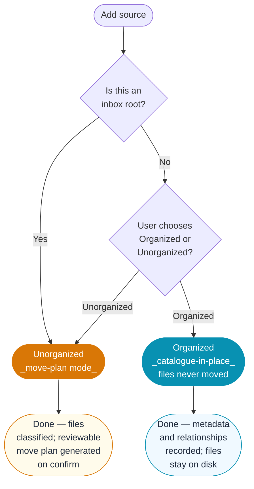

# Inbox: Organization-State Decision Flow

**Spec**: 041 — Inbox Plan Surface, US4 FR-019b
**Audience**: end-user wizard explainer + developer reference

---

## Plain-language explanation

When you add a new source folder to Astro Library Manager you are asked one
question: is this an **organized** library or an **unorganized** capture dump?

Choose **Organized** if your files are already sorted into a folder structure
you want to keep. The app will catalogue them exactly where they are — it will
never move them. Changes only exist in the database.

Choose **Unorganized** (inbox) if this is a raw capture dump, an SD card
import, or any folder that still needs sorting. The app classifies the files by
frame type, proposes a reviewable move plan, and waits for your approval before
touching anything on disk.

This choice is **per source** — you can have an organized archive root sitting
alongside an unorganized inbox root in the same library. You can also change the
setting for a source later if your workflow changes. Inbox-kind sources are
always treated as Unorganized: the inbox lane exists specifically to support the
move-plan workflow.

---

## Decision flowchart

---

## Notes for implementers

| Property | Detail |
|---|---|
| Scope | Per source root — not per-file and not global |
| Default for inbox roots | Always **Unorganized** (the lane implies it) |
| Default for non-inbox roots | User must choose — no silent default |
| Changeable later | Yes — stored in the source row; changing re-classifies on next scan |
| Effect on files | Organized → no filesystem mutations ever; Unorganized → move plan proposed on confirm, applied only after user approval |
| Plan generation | Triggered by `inbox.confirm`; the plan is reviewable before any file moves |

---

*Asset for the US4 wizard step explainer (spec 041, task T019/T021).*
