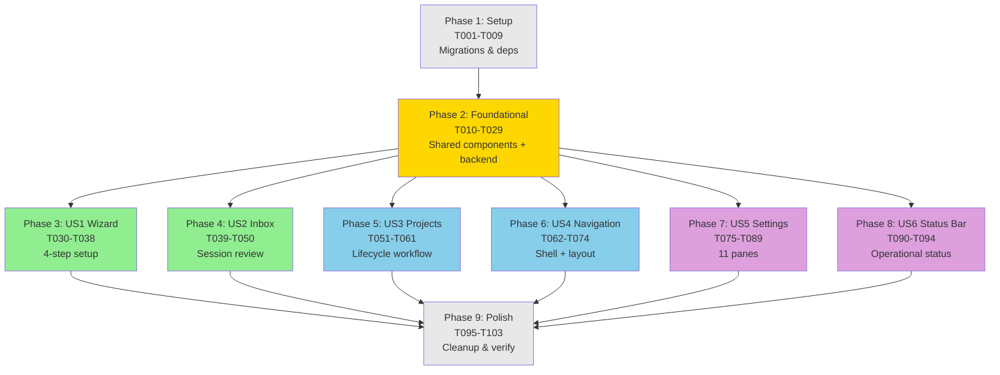
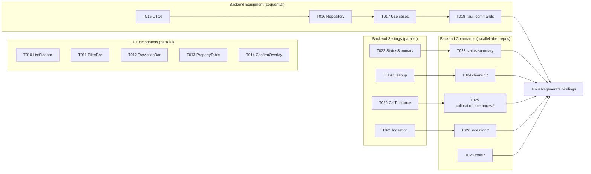

# Task Dependency Diagram: UI Audit & Revision

## Phase Dependencies (DAG)



## Parallel Tracks (after Phase 2)

```mermaid
gantt
    title Implementation Timeline
    dateFormat X
    axisFormat %s

    section Foundation
    Phase 1 Setup           :p1, 0, 1
    Phase 2 Foundational    :p2, 1, 3

    section Track A - Core Ingestion
    US1 Wizard              :p3, 3, 5
    US2 Inbox               :p4, 3, 6

    section Track B - Layout Overhaul
    US3 Projects            :p5, 3, 6
    US4 Navigation          :p6, 3, 6

    section Track C - Config & Status
    US5 Settings            :p7, 3, 6
    US6 Status Bar          :p8, 3, 5

    section Finalize
    Phase 9 Polish          :p9, 6, 7
```



## Foundational Phase Internal Dependencies



## Critical Path

```
P1 (Setup) → P2 (Foundational) → P4 (US2 Inbox) → P9 (Polish)
```

The critical path runs through Inbox (US2) because it's the most complex
user story (12 tasks) and the core ingestion workflow. Wizard (US1) is
simpler (9 tasks) and finishes sooner.

## Risk: Phase 6 ↔ Phase 5 Coordination

US4 (Navigation) rewrites the app shell (`Shell.tsx`, `router.tsx`,
`Sidebar.tsx`) which US3 (Projects) renders within. If worked in parallel:
- US4 shell changes should land first OR
- US3 should use the existing shell and be rebased after US4

Recommendation: Start US4 slightly before US3, or have US4's shell tasks
(T062-T064) complete before US3 begins.
