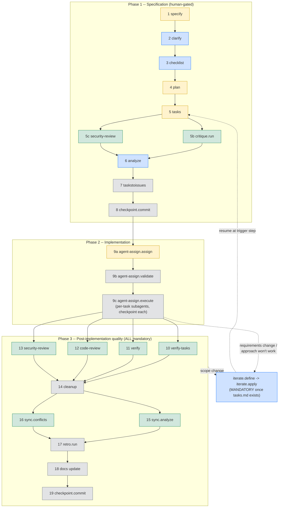

# CLAUDE.md
<!-- Generated by APM CLI -->
<!-- Build ID: 65ba349039cd -->
<!-- APM Version: 0.12.4 -->

# Project Standards

## Files matching `{.specify/**,specs/**,**/spec.md,**/tasks.md,**/pending-iteration.md}`

# SpecKit Workflow

## Rules

- All workflow steps are MANDATORY by default. Always suggest the next step in
  the default path. Only skip a step when the user explicitly requests it.
  Never silently omit steps because they seem "overkill" or "trivial."
- ALWAYS invoke speckit via Skill tool. NEVER write spec artifacts manually.
- ALWAYS get user approval between phases unless user says "run unattended."
  Even in unattended mode, INTERACTIVE commands (clarify, analyze, checklist)
  STILL require user input. Unattended only skips approval gates between
  non-interactive steps.
- NEVER proceed past any stage with open questions, unresolved gaps, or items
  requiring review. Present them to the user and resolve together first.
- NEVER silently deviate from spec. Material deviation -> stop -> explain ->
  get approval -> route through iterate. Minor deviation -> flag in commit.
- `/speckit.implement` is DEPRECATED. Use the agent-assign flow instead:
  `/speckit.agent-assign.assign` -> `/speckit.agent-assign.validate` ->
  `/speckit.agent-assign.execute`. This routes each task to a specialized
  sub-agent for better quality. Do not invoke `/speckit.implement`.
- ORCHESTRATOR REVIEW GATE: when sub-agents deliver work (execution, review,
  or fixes), the main orchestrator MUST review the actual code changes against
  the task requirements before accepting. Agent summaries describe intent, not
  necessarily what landed. Keep the sub-agent alive after it reports back -- use
  `SendMessage` to send corrections to the SAME agent so it retains its full
  context and fixes only the specific issues, not the entire task. Only dismiss
  the agent once the work passes review. This holds even under parallel
  (worktree-isolated) execution: review each agent's emitted diff before its
  worktree is reconciled.
- Requires the `agent-assign` specify extension (`specify extension add
  agent-assign`). Included in the canonical extension set for new projects.

## Workflow DAG

Legend: yellow = approval gate - blue = interactive (needs user) - green = runs parallel
with its pair - grey = automatic. Dashed edges = the iterate loop (scope change). The tables
below are the authoritative step reference.

### Phase 1 -- Specification (human-gated)

| Step | Command | Mode | Notes |
|------|---------|------|-------|
| 1 | `/speckit.specify` | auto -> approval | Creates spec.md |
| 2 | `/speckit.clarify` | INTERACTIVE | Ask questions, incorporate feedback |
| 3 | `/speckit.checklist` | INTERACTIVE | Quality gate on requirements |
| 4 | `/speckit.plan` | auto -> approval | Architecture and approach |
| 5 | `/speckit.tasks` | auto -> approval | Task breakdown with dependencies |
| 5b | `/speckit.critique.run` | parallel with 5c | Plan + task quality gate |
| 5c | `/speckit.security-review` | parallel with 5b | Security review of plan/tasks |
| 6 | `/speckit.analyze` | INTERACTIVE | Risk analysis, resolve before impl |
| 7 | `/speckit.taskstoissues` | auto | Creates GitHub/GitLab issues |
| 8 | `/speckit.checkpoint.commit` | auto | Snapshot before implementation |

### Phase 2 -- Implementation

| Step | Command | Mode | Notes |
|------|---------|------|-------|
| 9a | `/speckit.agent-assign.assign` | auto -> approval | Route tasks to specialized sub-agents |
| 9b | `/speckit.agent-assign.validate` | auto | Validate agent assignments |
| 9c | `/speckit.agent-assign.execute` | auto | Execute with assigned agents. Checkpoint after each task. |

### Phase 3 -- Post-implementation quality (ALL mandatory)

| Step | Command | Mode | Delegation |
|------|---------|------|------------|
| 10 | `/speckit.verify-tasks` | parallel with 11 | subagent (fresh context) |
| 11 | `/speckit.verify` | parallel with 10 | subagent |
| 12 | `/speckit.code-review` | parallel with 13 | subagent |
| 13 | `/speckit.security-review` | parallel with 12 | subagent |
| 14 | `/speckit.cleanup` | main thread | Auto-fix small, issue for large |
| 15 | `/speckit.sync.analyze` | parallel with 16 | subagent |
| 16 | `/speckit.sync.conflicts` | parallel with 15 | subagent |
| 17 | `/speckit.retro.run` | main thread | Needs full session context |
| 18 | Documentation update | main thread | Update affected docs |
| 19 | `/speckit.checkpoint.commit` | auto | Final commit |

## Scope Change (iterate)

TRIGGER: user changes requirements or agent discovers spec approach won't work.
CONDITION: iterate is MANDATORY once tasks.md exists. Before tasks.md, go back
to the relevant earlier step directly.

1. `/speckit.iterate.define "<change>"` -> writes `pending-iteration.md`
2. Present iteration plan to user -> ALWAYS
3. `/speckit.iterate.apply` -> updates spec/plan/tasks
4. Update issues for changed/removed/new tasks
5. IF cross-spec impact: `/speckit.sync.conflicts` immediately
6. `/speckit.checkpoint.commit`
7. Resume at the step where the change was triggered

## On Resume

1. Check current state: which step was last completed?
2. Resume at the appropriate workflow step
3. Use `/speckit.status.show` to see current spec state

## Command Reference

### Core workflow
- `specify` -- create spec.md from requirements
- `clarify` -- interactive requirements clarification
- `checklist` -- requirements quality gate
- `plan` -- architecture and implementation plan
- `tasks` -- task breakdown with dependency graph
- `analyze` -- risk analysis and gap detection
- `taskstoissues` -- create GitHub/GitLab issues from tasks
- `checkpoint.commit` -- snapshot current state

### Implementation
- `agent-assign.assign` -- route tasks to specialized sub-agents
- `agent-assign.validate` -- validate agent assignments
- `agent-assign.execute` -- execute with assigned agents
- `tinyspec.classify` -- classify a change as spec-worthy or tiny
- `tinyspec.tinyspec` -- lightweight spec for small changes
- `tinyspec.implement` -- execute a tinyspec task (ONLY after tinyspec.classify -> tinyspec.tinyspec)
- `implement` -- DEPRECATED, use agent-assign flow for full specs, tinyspec.implement for tinyspecs

### Quality
- `verify` -- validate code against spec (subagent)
- `verify-tasks` -- phantom completion detection (subagent, fresh context)
- `cleanup` -- code quality fixes
- `sync.analyze` -- drift detection between spec and code
- `sync.conflicts` -- inter-spec contradiction check

### Iteration
- `iterate.define` -- define a scope change
- `iterate.apply` -- apply iteration to spec/plan/tasks

### Review
- `review.run` -- full review cycle
- `review.code` -- code review
- `review.tests` -- test review
- `review.types` -- type safety review
- `review.errors` -- error handling review
- `review.simplify` -- simplification review
- `review.comments` -- comment review
- `critique.run` -- template-based critique

### Process
- `retro.run` -- retrospective analysis
- `status.show` -- current spec status
- `qa.run` -- QA cycle
- `fix-findings` -- fix issues from verify/review/qa
- `reconcile.reconcile` -- reconcile divergent state
- `doctor.check` -- diagnose speckit health

### Memory
- `memory-md.init` -- initialize layered memory
- `memory-md.capture` -- capture findings to memory
- `memory-md.capture-from-diff` -- capture from git diff
- `memory-md.prepare-context` -- load relevant memory before work
- `memory-md.plan-with-memory` -- plan using memory context
- `memory-md.log-finding` -- log a single finding
- `memory-md.audit` -- audit memory health
- `memory-md.token-report` -- memory token usage
- `memory-md.share-lesson` -- share lesson across projects
- `memory-md.sync-shared` -- sync shared lessons

### Diagrams
- `diagram.status` -- status diagram
- `diagram.dependencies` -- dependency diagram
- `diagram.workflow` -- workflow diagram

### Git/Worktree
- `worktree.create` -- create isolated worktree
- `worktree.list` -- list active worktrees
- `worktree.clean` -- clean up worktrees
- `archive.archive` -- archive completed spec

### GitHub Issues
- `github-issues.link` -- link issues to spec
- `github-issues.sync` -- sync issue state
- `github-issues.import` -- import issues as tasks

### Brownfield
- `brownfield.scan` -- scan existing codebase
- `brownfield.validate` -- validate scan results
- `brownfield.bootstrap` -- bootstrap spec from scan
- `brownfield.migrate` -- migrate to speckit workflow

### Onboarding
- `onboard.start` -- start onboarding
- `onboard.explain` -- explain a concept
- `onboard.quiz` -- knowledge check
- `onboard.mentor` -- mentoring session
- `onboard.badge` -- award badge
- `onboard.trail` -- learning trail
- `onboard.team` -- team onboarding

### Optimization
- `optimize.run` -- optimization pass
- `optimize.tokens` -- token optimization
- `optimize.learn` -- learn from optimization

### Fleet
- `fleet.fleet` -- fleet operations
- `fleet.review` -- fleet review

### Refine
- `refine.update` -- refine spec
- `refine.diff` -- show refinement diff
- `refine.propagate` -- propagate refinement
- `refine.status` -- refinement status

### Agent Assignment
- `agent-assign.assign` -- assign agent to task
- `agent-assign.validate` -- validate assignment
- `agent-assign.execute` -- execute assigned task

### Governance
- `conduct.conduct` -- code of conduct check
- `constitution` -- constitution review

## Files matching `{specs/**,.specify/**}`

# Astro Specs

Keep `specs/` focused on feature artifacts, not implementation code. Treat
feature artifacts as the source of truth for feature intent, scope, and
sequencing.

Keep phase outputs aligned: `spec.md`, `plan.md`, `tasks.md`, and supporting
artifacts should not drift. Update the feature artifacts you change together
instead of patching one file in isolation.

Prefer bounded feature directories under `specs/NNN-feature-name/`.

Keep implementation details at the planning level unless they are true
requirements. Record explicit exclusions, trims, and deferred work instead of
leaving silent gaps.

Before closing a feature, verify artifact consistency and task truthfulness.
The active feature currently lives under `specs/001-astro-library-manager/`.

---
*This file was generated by APM CLI. Do not edit manually.*
*To regenerate: `apm compile`*
